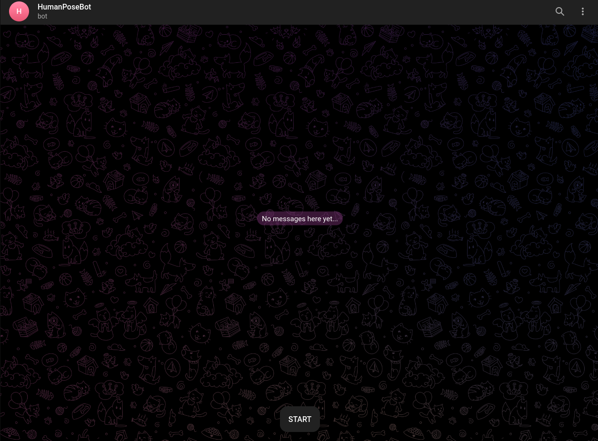
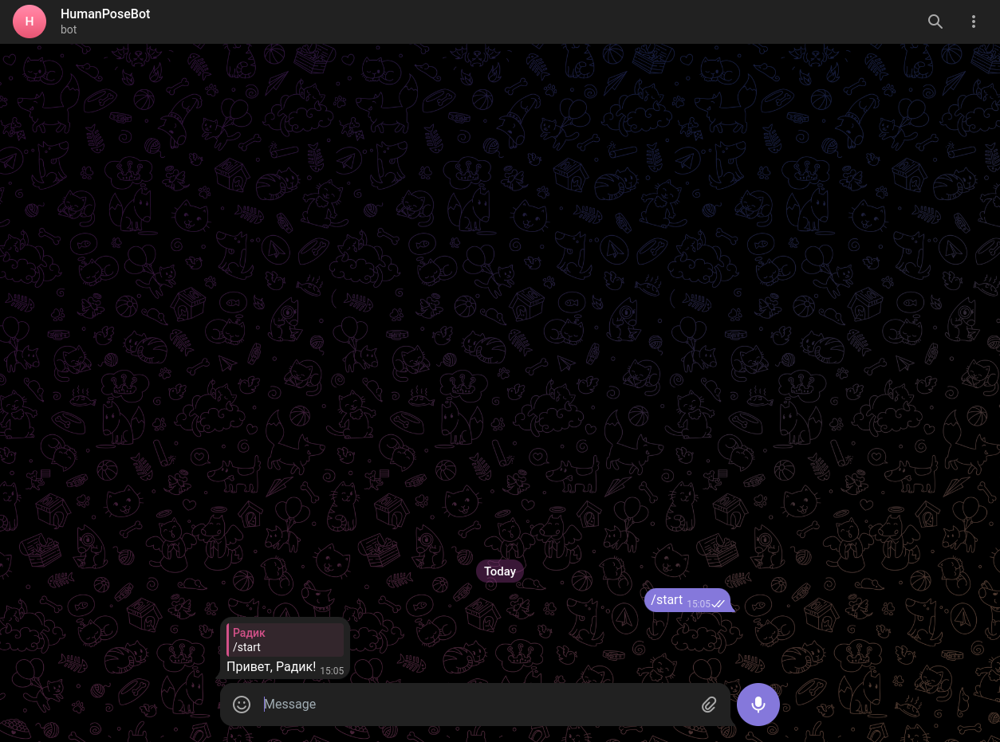
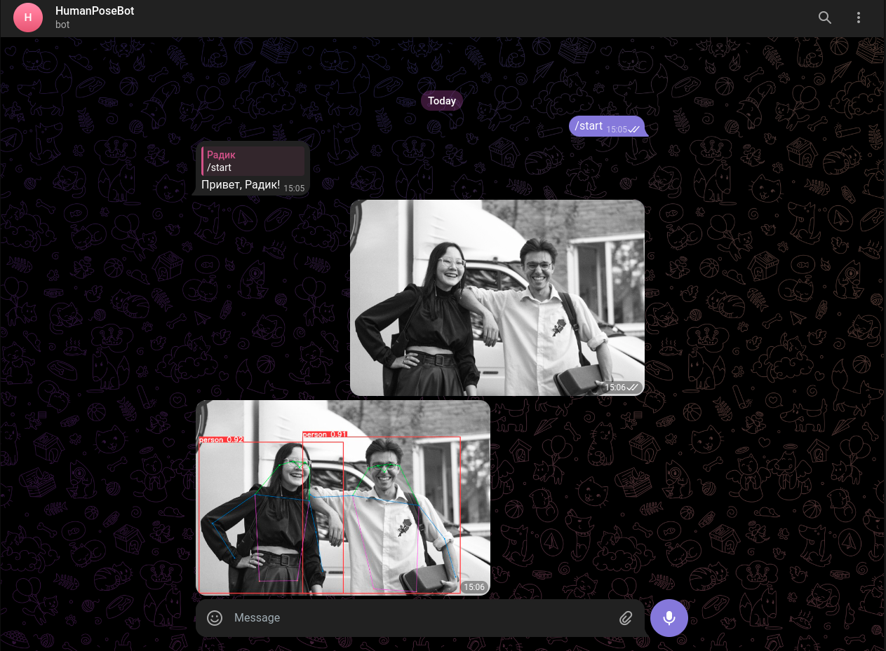

# HumanPoseBot
This project contains source code for a Telegram bot [HumanPoseBot](https://t.me/humanposebot) estimating human pose by picture.

## Dependencies
- [x] [CUDA 11.8](https://developer.nvidia.com/cuda-11-8-0-download-archive?target_os=Linux)
- [x] [cuDNN 8.9](https://developer.nvidia.com/downloads/compute/cudnn/secure/8.9.4/local_installers/11.x/cudnn-local-repo-ubuntu2004-8.9.4.25_1.0-1_amd64.deb/)
- [x] [Git](https://www.digitalocean.com/community/tutorials/how-to-install-git-on-ubuntu-20-04)
- [x] [Python 3.10](https://computingforgeeks.com/how-to-install-python-on-ubuntu-linux-system/)
- [x] [Python3-pip](https://linuxize.com/post/how-to-install-pip-on-ubuntu-20.04/)
- [x] [Python3-venv](https://www.digitalocean.com/community/tutorials/how-to-install-python-3-and-set-up-a-programming-environment-on-ubuntu-20-04-quickstart)

## Quick start on Ubuntu
Create and activate virtual environment via python-venv or Anaconda.
```
python3.10 -m venv venv
source venv/bin/activate
```

```
conda create -n venv python=3.10
source activate venv
```

Install Poetry package manager.
```
pip install poetry
```

Install external python packages via Poetry.
```
poetry install
```

Define token of your telegram bot in **main.py**. You may also specify human detection and pose estimation model from this list:
- yolov8n-pose.pt *(recommended)*
- yolov8s-pose.pt
- yolov8m-pose.pt
- yolov8l-pose.pt
- yolov8x-pose.pt

```python
TOKEN = "YOUR-TOKEN"
MODEL = "models/yolov8n-pose.pt"
```

Host bot on your computer.
```
python main.py
```

## Test
Start the bot via Telegram specifying its name. If your source code is correct the bot replies with greeting message.




Send your image to the bot. You should upload picture as image -- not as file/document. If everything is correct the bot replies with processed image.

